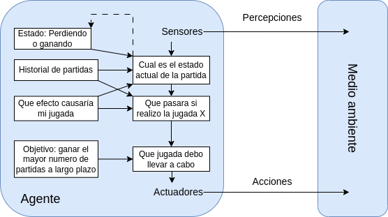

# rps
RPS

## Contorno de tareas 

Contorno de tareas | Observable| Agentes | Determinista | Episódico | Estático | Discreto | Conocido
:---: | :---: | :---: | :---: | :---: | :---: | :---: | :---: |
 RPS | Parcialmente | Multiagente | Estocástico | Secuencial | Estático |  Discreto |  Conocido |

 Explicación de las características elegidas:

- **Observable**: Parcialmente, ya que no podemos saber qué está pensando el otro jugador.

- **Agentes**: Multiagente, ya que el juego cuenta con varios jugadores.

- **Determinista**: Estocástico, ya que no podemos predecir el movimiento del otro jugador de manera exacta.

- **Episódico**: Secuencial, ya que las anteriores partidas pueden utilizarse para determinar una jugada futura.

- **Estático**: Estático, ya que el entorno no cambia con el paso del tiempo.

- **Discreto**: Discreto, ya que la acción toma lugar en un único momento pasando de un estado a otro.

- **Conocido**: Conocido, ya que tienes conocimiento sobre las reglas por las que se rige el juego

## Estrutura del agente

El modelo elegido es el de agente basado en objetivos.

